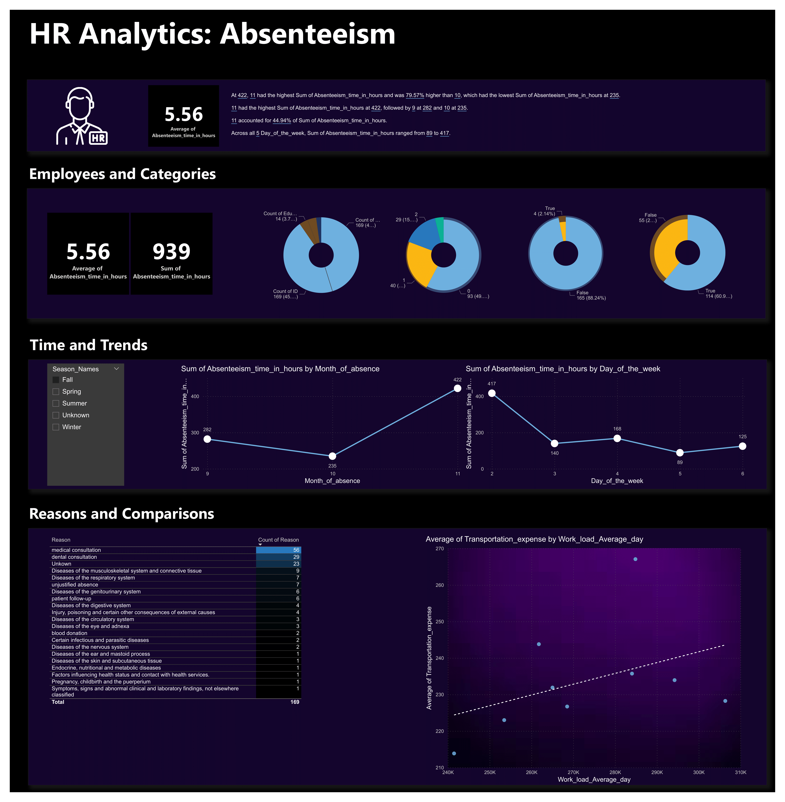

# HR-Analytics-Absenteeism

Analysis of an HR dataset about absenteeism and health. A data-driven approach is used to determine how to provide a bonus and incentive to healthy employees.

The project includes:
- Development of a database
- SQL queries to answer given questions
- A dashboard built using Power BI which meets a wireframe specification

This is an end-to-end project.

## 🔍 Dashboard Preview

